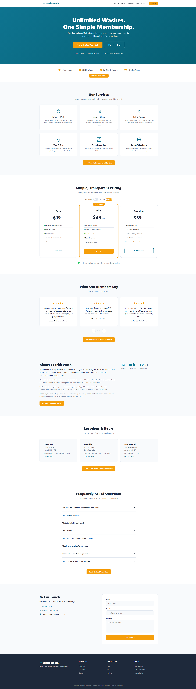

# Adaptive Landing Page AI


A Django-based system that **personalises a landing page in real time** using a
contextual multi-armed bandit algorithm. The system tracks every visitor
interaction, builds per-user engagement profiles, and automatically adjusts
section visibility, compactness, and variant styling to maximise conversions.

> **Status:** Tracking, per-session intent scoring, and a **combinational
> contextual multi-armed bandit (slate bandit)** are implemented and
> functional. The model still uses per-arm linear ridge regression +
> epsilon-greedy, but now chooses up to 3 compatible arms per returning visit,
> merges their configs, and applies observation-gated reward updates.
> See [BANDIT.md](BANDIT.md) for full details.

---

## Table of Contents

1. [Project Goal](#project-goal)
2. [Before vs After (Screenshots)](#before-vs-after-screenshots)
3. [Architecture Overview](#architecture-overview)
4. [Tech Stack](#tech-stack)
5. [What Has Been Implemented](#what-has-been-implemented)
6. [What Is Next](#what-is-next)
7. [Project Structure](#project-structure)
8. [Database Schema](#database-schema)
9. [Data Flow](#data-flow)
10. [Setup & Running](#setup--running)
11. [Legacy / Prototype Code](#legacy--prototype-code)
12. [Bandit Testing & Evaluation](#bandit-testing--evaluation)

---

## Project Goal

Traditional A/B testing shows every visitor the same variant and requires large
sample sizes before reaching significance. This project replaces A/B testing
with a **contextual multi-armed bandit** that:

- **Explores** different page configurations (section order, variants, CTA
  emphasis, hidden/promoted sections) across visitors.
- **Exploits** configurations that perform well for visitors with similar
  context (return vs. new, referrer, device, engagement history).
- **Converges** on high-conversion layouts faster than a fixed A/B split.

The landing page used as the test case is a fictional car-wash membership site
(**SparkleWash**) with 11 sections (header, hero, trust bar, services, pricing,
testimonials, about, locations, FAQ, contact, footer).

---

## Before vs After (Screenshots)

The images below show a default page state and an adapted state after applying
bandit-style UI changes (section promotion, testimonial variant, service
emphasis).

| Before (Default) | After (Adapted) | After (Alternative Adapted Variant) |
|---|---|---|
|  | .png) | .png) |

---

## Architecture Overview

```
┌─────────────────────────────────────────────────────────┐
│                      Browser                            │
│                                                         │
│  landing_page.html                                      │
│    ├── ui.js        (cookie consent, UI interactions)   │
│    └── tracking.js  (event tracking, batching, flush)   │
│                                                         │
│  ① Accept cookies  ──POST /accept-cookies/──►           │
│  ② Batch events    ──POST /track-interactions/──►       │
│  ③ End session     ──POST /end-session/──►              │
└──────────────────────────────┬──────────────────────────┘
                               │
                               ▼
┌─────────────────────────────────────────────────────────┐
│                   Django Backend                        │
│                                                         │
│  views.py                                               │
│    ├── accept_cookies()   → Visitor + Session creation   │
│    ├── track_interactions() → Event bulk_create          │
│    ├── end_session()      → compute intent scores        │
│    └── demo_landing_page()  → serves landing_page.html  │
│                                                         │
│  models.py                                              │
│    ├── Visitor       (cookie-based identity)            │
│    ├── Session       (one per page-load, visit_number)  │
│    ├── Event         (every tracked interaction)        │
│    ├── BanditArm     (page config + affected sections)  │
│    ├── BanditDecision(1:1 with session, logs slate)     │
│    └── LinUCBParam   (per-arm learned weights)          │
│                                                         │
│  bandit_utils.py (context → score arms → choose slate)  │
│  utils.py        (section scores + intent computation)  │
└──────────────────────────────┬──────────────────────────┘
                               │
                               ▼
┌─────────────────────────────────────────────────────────┐
│              PostgreSQL  (adaptive_landing)              │
│                                                         │
│  landing_visitor  ──1:N──  landing_session               │
│  landing_session  ──1:N──  landing_event                 │
│  landing_session  ──1:1──  landing_banditdecision        │
│  landing_banditarm ──1:1── landing_linucbparam           │
└─────────────────────────────────────────────────────────┘
```

---

## Tech Stack

| Layer       | Technology                              |
| ----------- | --------------------------------------- |
| Backend     | Python 3, Django 4.2                    |
| Database    | PostgreSQL (via psycopg2-binary)         |
| Frontend    | Vanilla JS, Django templates, CSS       |
| Tracking    | Custom event pipeline (tracking.js)     |
| AI          | Combinational contextual bandit: per-arm linear ridge regression + ε-greedy slate selection (numpy) |

---

## What Has Been Implemented

### Visitor & Cookie Tracking

- **Long-lived visitor identity** via a `visitor_id` cookie (UUID, 1-year
  expiry) set by the backend on cookie acceptance.
- **Cookie consent modal** in the landing page — tracking only begins after the
  user explicitly clicks "Accept Cookies".
- `POST /accept-cookies/` handles both **first-time** and **returning**
  visitors:
  - New visitor → creates `Visitor` + `Session`, sets `visitor_id` cookie.
  - Returning visitor → finds existing `Visitor` (from cookie), closes stale
    sessions, creates a fresh `Session`.
  - Returns `session_id`, `visitor_id`, `visit_number`, and for returning
    visits includes slate output (`chosen_arms`, merged `page_config`,
    `explore`).

### Session Management

- One `Session` per page-load (created server-side, UUID passed to JS).
- `user_agent` and `referrer` captured automatically from request headers.
- Previous active sessions are closed (`is_active=False`, `ended_at` stamped)
  when a new session starts.

### Frontend Event Tracking (`tracking.js` v3)

The tracker captures 9 event types using data attributes:

| Event Type      | Trigger                                      | Key Fields                        |
| --------------- | -------------------------------------------- | --------------------------------- |
| `page_view`     | Once on page load                            | `referrer`                        |
| `click`         | Any `[data-track-click]` element             | `element`, `section`, `tag`, `text`, `is_cta` |
| `hover`         | Mouse dwell on `[data-track-click]` (>200ms) | `element`, `section`, `duration_ms`, `is_cta` |
| `section_view`  | Section first enters viewport (30%)          | `section`                         |
| `section_dwell` | Section leaves viewport or page unload       | `section`, `duration_ms`, `read`  |
| `scroll_depth`  | 25 / 50 / 75 / 100% milestones              | `depth`                           |
| `time_on_page`  | Page hide / unload                           | `seconds`                         |
| `form_focus`    | User focuses a form field                    | `section`, `field`                |
| `form_submit`   | Form submitted                               | `section`, `form_id`              |

Events are queued in memory and flushed:
- Every 5 seconds (batch timer).
- When the queue reaches 50 events.
- On `visibilitychange` (tab hidden) and `beforeunload` (via `sendBeacon`).

The tracker **never generates its own session ID** — it requires a server-provided UUID from `/accept-cookies/` before it will start.

### Backend Event Storage (`POST /track-interactions/`)

- Receives `{ session_id, events: [...] }` from the frontend.
- Maps commonly-queried fields (`event_type`, `section`, `element`, `is_cta`,
  `duration_ms`) to dedicated database columns for fast filtering.
- Stores all remaining event fields in a `metadata` JSONField (so the frontend
  can evolve without requiring migrations).
- Uses `bulk_create` for efficiency.

### Session Intent Scoring (`POST /end-session/`)

When the user leaves the page (tab hidden / window closed), the frontend calls
`POST /end-session/` via `sendBeacon`. The backend then:

1. Marks the session as ended (`ended_at`, `is_active=False`).
2. Queries all `Event` rows for that session.
3. Computes **intent feature scores** and persists them on the `Session` row.

#### Computed fields

| Field | Type | Description |
|---|---|---|
| `price_intent_score` | float 0–1 | Engagement with the **pricing** section |
| `service_intent_score` | float 0–1 | Engagement with the **services** section |
| `trust_intent_score` | float 0–1 | Engagement with **testimonials + FAQ + trust bar + about** |
| `location_intent_score` | float 0–1 | Engagement with the **locations** section |
| `contact_intent_score` | float 0–1 | Engagement with the **contact** section |
| `quick_scan_score` | float 0/1 | 1 if user scrolled ≥ 75 % but total dwell < 5 s |
| `primary_intent` | string | Dominant bucket: `"price"`, `"service"`, `"trust"`, `"location"`, `"contact"`, or `"unknown"` |
| `max_scroll_pct` | int 0–100 | Deepest scroll-depth milestone reached |
| `engaged_time_ms` | int | Total active time on the page (ms) |
| `cta_clicked` | bool | Whether any CTA element was clicked |
| `conversion` | bool | Placeholder for future conversion tracking |

#### Section → intent mapping

| Intent bucket | Sections included | Rationale |
|---|---|---|
| **price** | `pricing` | Plan comparison, price-focused engagement |
| **service** | `services` | Understanding what’s offered |
| **trust** | `testimonials`, `faq`, `trust-bar`, `about` | All “can I trust this company?” content — reviews, badges, company story |
| **location** | `locations` | Checking physical accessibility → serious purchase consideration |
| **contact** | `contact` | Form engagement, clicking details → direct outreach intent |

**Hero** is excluded — every visitor sees it first so dwell is noise, and its
CTAs point to `#pricing` which is already tracked. **Header** and **footer**
carry no meaningful intent signal.

#### Scoring formula (v2)

Each intent bucket collects five per-section signals:

| # | Signal | Normalisation | Half-saturation (k) |
|---|--------|---------------|---------------------|
| 1 | Clicks in section | `clicks / (clicks + k)` | 3 clicks |
| 2 | Hover time (ms) | `hover_ms / (hover_ms + k)` | 5 000 ms |
| 3 | Section dwell (ms) | `dwell_ms / (dwell_ms + k)` | 15 000 ms |
| 4 | CTA click | `min(cta_clicks, 1)` (binary) | — |
| 5 | CTA hover time (ms) | `cta_hover_ms / (cta_hover_ms + k)` | 3 000 ms |

All signals use the saturation function `f(x) = x / (x + k)` which maps
0 → 0 and approaches 1 for large values — **no hard caps**.

```
intent_score = mean(click_signal, hover_signal, dwell_signal,
                    cta_click_signal, cta_hover_signal)      → 0..1

primary_intent = argmax(price, service, trust, location, contact)  if max ≥ 0.1
                 else "unknown"

quick_scan = 1.0  if  scroll ≥ 75%  AND  total_dwell < 5 s
             else 0.0
```

Signals are combined with **equal weights** — no manual tuning until real
data is available to learn better coefficients.

#### Security / idempotency

- The endpoint validates that the `session_id` belongs to the `visitor_id`
  cookie (prevents cross-visitor poisoning).
- Calling the endpoint multiple times simply recomputes and overwrites scores.

### Landing Page (Hardcoded)

- `templates/landing/landing_page.html` — the single landing page served at `/demo/`.
- 11 section templates in `templates/sections/` (header, hero, trust_bar,
  services, pricing, testimonials, about, locations, faq, contact, footer).
- Each section uses `data-track` and `data-track-click` attributes for the
  event tracker.
- `ui.js` handles all interactive UI (carousel, pricing toggle, FAQ accordion,
  smooth scroll, section variant helpers, cookie consent flow).

### Combinational Contextual Multi-Armed Bandit (Slate)

The bandit runs for returning visitors (visit ≥ 2). First visits remain control
(no decision row, no page change) and only collect tracking data.

- **Arms (23)** — each `BanditArm` row holds a `page_config` JSON dict
  consumed by `applyPageConfig()` on the frontend. Arms cover per-section
  compaction, hiding, promoting to top, and variant styles (highlight plans,
  feature services, CTA emphasis, etc.). Seeded via
  `python manage.py seed_bandit_arms`.
- **Context** — `build_context()` turns a visitor into an **8-number feature
  vector**: `[is_mobile, price_score, service_score, trust_score,
  location_score, contact_score, visit_number_norm, bias]`. All values are
  continuous (0–1), nothing is thrown away into discrete buckets.
- **Per-arm model** — each arm has its own `LinUCBParam` storing an 8×8
  `A_matrix` ("what visitors it has seen") and an 8-element `b_vector`
  ("what worked"). Weights are computed as `A⁻¹ × b` — i.e. "what worked"
  divided by "what I've seen".
- **Slate policy (K=3)** — arms are scored per context, sorted by predicted
  reward, then greedily selected into a conflict-free slate of up to 3 arms.
- **Conflict rules** — no duplicates, no variant-key collisions, no multiple
  promote actions, and no hide-vs-modify conflicts on the same section.
- **Exploration** — epsilon-greedy is still used (ε = 0.10), but exploration
  now replaces one slot in the slate with a random valid non-conflicting arm.
- **Merged config** — chosen arms are merged into one deterministic page_config
  payload (compact/hide unions, single promote, merged variants).
- **Reward** — binary full-bandit reward: 1.0 if cta_clicked, else 0.0.
- **Observation-gated learning** — each chosen arm is updated only if at least
  one of its affected_sections was observed by the visitor (section_view or
  section_dwell event).
- **Decision logging** — BanditDecision stores chosen_arm_ids, merged_page_config,
  reward, and updated_arm_ids for debugging and idempotent processing.

Full details: [BANDIT.md](BANDIT.md)

### Bandit Testing & Evaluation (Simulator)

The project includes a simulation command for algorithm testing using your real
DB arms and real bandit selection/update functions.

- **Command:** `python manage.py simulate_bandit --rounds 20000 --k 3 --epsilon 0.1 --seed 42`
- **Bandit path:** uses real `choose_slate(...)` and (unless `--dry-run`) real
  `update_stats(...)` so LinUCB DB params are actually updated.
- **Baselines:** evaluates a conflict-safe random slate and a no-change policy
  on the same synthetic contexts (no baseline learning updates).
- **Outputs:** round-level CSV + cumulative/moving-average PNG learning curves
  + summary CTR by policy/persona/device.

Use `--reset-params` to start from a clean model state and `--dry-run` for
evaluation-only runs.

For full simulator details (personas, reward model, baselines, metrics,
calibration tips), see [Simulator.md](Simulator.md).

### Django Admin

All models (`Visitor`, `Session`, `Event`, `BanditArm`, `BanditDecision`,
`LinUCBParam`) are registered in the admin with appropriate `list_display`,
`list_filter`, and `search_fields` for easy debugging and data inspection.

---

## What Is Next

1. **Richer reward signal** — extend beyond the binary CTA-click reward to
   incorporate scroll depth, section dwell, and intent scores as a composite
   reward.

2. **Joint slate optimization** — current learning is per-arm with
  compatibility filtering. A future upgrade could model interaction effects
  between arm combinations directly.

3. **Counterfactual evaluation and offline replay** — add tooling to compare
  candidate policies safely before rollout.

---

## Project Structure

```
adaptive-landing-ai/
├── manage.py
├── core/                       # Django project settings
│   ├── settings.py
│   ├── urls.py
│   └── wsgi.py
├── landing/                    # Main application
│   ├── models.py               # Visitor, Session, Event, BanditArm, BanditDecision, LinUCBParam
│   ├── views.py                # Endpoints + page views
│   ├── urls.py                 # URL routing
│   ├── admin.py                # Admin registrations
│   ├── bandit_utils.py         # Context → score arms → choose slate → update weights
│   ├── utils.py                # Scoring utilities + intent computation
│   ├── ai_llm.py               # Legacy: LLM recommendation call
│   ├── management/commands/seed_bandit_arms.py  # Seed starter arms
│   └── migrations/
├── static/
│   ├── landing/
│   │   ├── styles.css          # Landing page styles
│   │   ├── tracking.js         # Event tracking (v3)
│   │   └── ui.js               # UI interactions + cookie consent
│   └── js/
│       └── cookie_consent.js   # Legacy: old cookie handler
├── templates/
│   ├── base.html               # Base HTML template
│   ├── landing/
│   │   ├── landing_page.html   # Hardcoded landing page (current)
│   │   ├── index_dynamic.html  # Legacy: dynamic builder-based page
│   │   └── index.html          # Legacy
│   ├── sections/               # 11 section partials
│   │   ├── header.html
│   │   ├── hero.html
│   │   ├── trust_bar.html
│   │   ├── services.html
│   │   ├── pricing.html
│   │   ├── testimonials.html
│   │   ├── about.html
│   │   ├── locations.html
│   │   ├── faq.html
│   │   ├── contact.html
│   │   └── footer.html
│   └── builder/                # Legacy: page builder templates
└── fyp_env/                    # Python virtual environment
```

---

## Database Schema

### Tracking Models (active)

```
Visitor
  ├── cookie_id      UUID (unique, auto-generated)
  ├── created_at     datetime
  └── last_seen      datetime (auto-updated)

Session
  ├── visitor                FK → Visitor
  ├── session_id             UUID (unique, auto-generated)
  ├── visit_number           integer   (1 = first visit, 2+ = returning)
  ├── started_at             datetime
  ├── ended_at               datetime (nullable, indexed)
  ├── user_agent             text
  ├── referrer               URL
  ├── is_active              boolean (indexed)
  ├── max_scroll_pct         integer   (0–100)
  ├── engaged_time_ms        integer   (ms)
  ├── cta_clicked            boolean
  ├── conversion             boolean   (placeholder)
  ├── price_intent_score     float     (0–1)
  ├── service_intent_score   float     (0–1)
  ├── trust_intent_score     float     (0–1)
  ├── location_intent_score  float     (0–1)
  ├── contact_intent_score   float     (0–1)
  ├── quick_scan_score       float     (0 or 1)
  └── primary_intent         char(32)  (indexed)

Event
  ├── session         FK → Session
  ├── event_type      char     (indexed)
  ├── timestamp       datetime (client-side)
  ├── created_at      datetime (server-side)
  ├── url             char
  ├── section         char     (indexed)
  ├── element         char
  ├── is_cta          boolean  (nullable)
  ├── duration_ms     integer  (nullable)
  └── metadata        JSON     (catch-all)
```

### Bandit Models (active)

```
BanditArm
  ├── arm_id            char(100)  (unique, machine-readable key)
  ├── name              char(255)  (human label)
  ├── page_config       JSON       (consumed by applyPageConfig on frontend)
  ├── affected_sections JSON[]     (sections this arm modifies)
  ├── is_active         boolean    (inactive arms excluded from selection)
  └── created_at        datetime

BanditDecision  (one per session where bandit ran)
  ├── session            1:1 → Session
  ├── visitor            FK → Visitor
  ├── context_json       JSON       (human-readable context snapshot)
  ├── context_vector     JSON       (feature vector — list of 8 floats)
  ├── arm                FK → BanditArm (legacy, nullable)
  ├── chosen_arm_ids     JSON[]     (slate arm_id list)
  ├── merged_page_config JSON       (final config sent to frontend)
  ├── explore            boolean
  ├── epsilon            float
  ├── reward             float      (nullable, filled at session end)
  ├── updated_arm_ids    JSON[]     (arms updated after observation gating)
  └── created_at         datetime

LinUCBParam  (one per arm — learned weights for linear model)
  ├── arm             1:1 → BanditArm
  ├── A_matrix        JSON       (8×8 matrix — "what visitors this arm has seen")
  ├── b_vector        JSON       (8-element list — "what worked")
  ├── n               int        (total pulls)
  └── updated_at      datetime
```

### Other Models (legacy)

- `LandingPage` / `LandingSection` — legacy page builder (not actively used).
- `AIRecommendation` — legacy LLM response log.

---

## Data Flow

```
Page load → ui.js initCookieConsent()
  │
  ├── No consent cookie → show modal → user clicks Accept
  │     → set sw_cookie_consent cookie (JS)
  │
  └── Has consent (or just accepted) → startTracking()
        │
        ├── POST /accept-cookies/
        │     → backend creates/finds Visitor + new Session
        │     → Set-Cookie: visitor_id=<uuid> (1 year)
        │     → computes visit_number
        │     → IF visit ≥ 2: builds feature vector, bandit picks slate (K=3)
        │       → merges page config, saves BanditDecision
        │     → returns { session_id, visit_number, chosen_arms, page_config }
        │
        ├── ui.js applyPageConfig(page_config)
        │     → applies compact / hide / promote / variant changes to DOM
        │
        └── SparkleTracker._init(session_id)
              ├── Emits page_view event
              ├── Wires click, hover, section, scroll, time, form listeners
              ├── Batch timer every 5s → POST /track-interactions/
              │     → { session_id, events: [...] }
              │     → bulk_create → Event table
              │
              └── visibilitychange / beforeunload
                    ├── flush() → send remaining events
                    └── endSession() → POST /end-session/
                        → compute intent scores
                        → IF visit ≥ 2: idempotent reward update
                        → update only observed arms in chosen slate
                        → update Session row
```

---

## Setup & Running

### Prerequisites

- Python 3.10+
- PostgreSQL running locally

### Installation

```bash
# Clone and enter the project
cd adaptive-landing-ai

# Create and activate virtual environment
python -m venv fyp_env
fyp_env\Scripts\activate        # Windows
# source fyp_env/bin/activate   # macOS/Linux

# Install dependencies
pip install django psycopg2-binary

# Create the PostgreSQL database
# (Expects: database=adaptive_landing, user=fyp, password=fyp123)

# Run migrations
python manage.py migrate

# Create a superuser (for /admin/ access)
python manage.py createsuperuser

# Start the dev server
python manage.py runserver
```

### Key URLs

| URL                     | Description                        |
| ----------------------- | ---------------------------------- |
| `/demo/`                | Hardcoded landing page             |
| `/admin/`               | Django admin (inspect tracked data)|
| `POST /accept-cookies/` | Cookie acceptance + session start  |
| `POST /track-interactions/` | Batched event ingestion        |
| `POST /end-session/`        | End session + compute intent scores + idempotent slate reward update |

---

## Legacy / Prototype Code

The initial prototype used a different approach — a **landing page builder** that
let developers create pages via a Django admin-like UI, and used **ChatGPT
(OpenAI API)** as the AI engine to generate layout recommendations based on
section HTML and engagement data.

The following files remain from that prototype but are **not actively used** in
the current implementation:

| File / Directory             | Purpose (legacy)                                |
| ---------------------------- | ----------------------------------------------- |
| `landing/ai_llm.py`         | OpenAI API call to generate LLM recommendations |
| `templates/builder/`        | Page builder UI templates                        |
| `templates/landing/index_dynamic.html` | Dynamic page rendered from DB sections |
| `static/js/cookie_consent.js` | Old cookie consent handler (replaced by `ui.js`) |
| `static/js/page_builder.js` | Builder frontend logic                           |
| Builder views in `views.py` | `builder_*` endpoints for CRUD on pages/sections |
| `LandingPage` / `LandingSection` models | DB-driven page/section storage      |
| `AIRecommendation` model    | Logged LLM responses                             |

These may be cleaned up or repurposed in future iterations.
